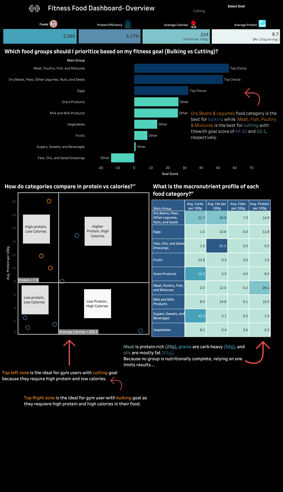
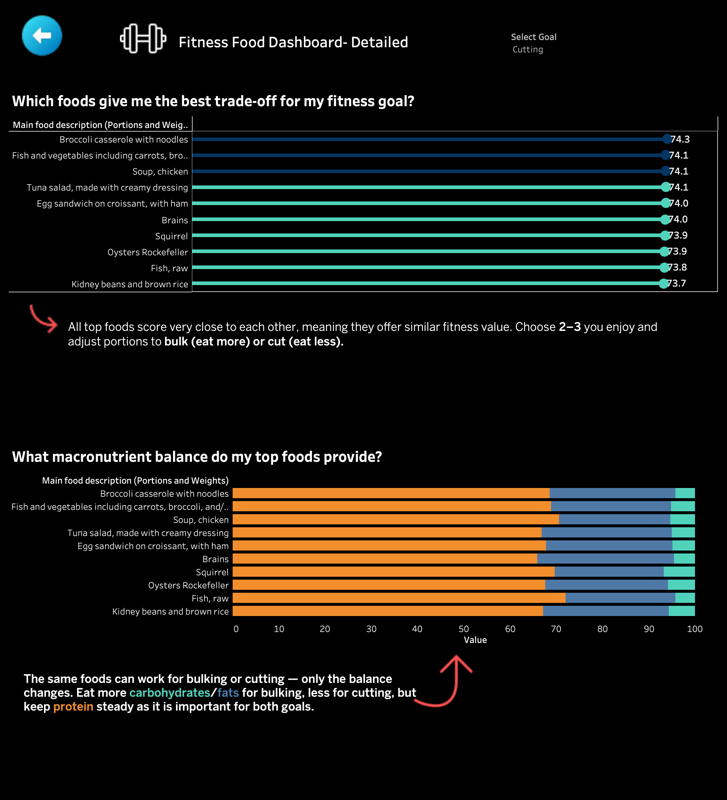

# 🏋️ Fitness Food Dashboard

> **Helping fitness users choose the right foods for Bulking or Cutting — without nutrition expertise.**



---

## ❌ The Problem

Fitness enthusiasts struggle to choose the right foods for their goals. With **5,395 foods** and confusing nutrition labels, making smart choices requires nutrition expertise most people don't have.

**The result?** Guesswork, frustration, and missed fitness targets.

---

## ✅ The Solution

An interactive Tableau dashboard that answers one simple question:

> *"Which foods should I prioritize for my Bulking or Cutting goal?"*

**One click. Instant recommendations. No nutrition degree required.**

---

## 📊 Key Insights

### For Cutting (Fat Loss)
| Rank | Food Category | Goal Score |
|------|---------------|------------|
| 1 | Meat, Poultry, Fish & Mixtures | **53.1** |
| 2 | Dry Beans, Peas, Legumes, Nuts & Seeds | **44.3** |
| 3 | Eggs | Top Choice |

### For Bulking (Muscle Gain)
- Same top categories, but **portion strategy changes**
- Top-right quadrant foods = high protein + high calories
- Grains (50g carbs) provide workout energy

### Top Foods for Cutting
| Food | Goal Score |
|------|------------|
| Broccoli casserole with noodles | 74.3 |
| Fish and vegetables with carrots & broccoli | 74.1 |
| Soup, chicken | 74.1 |
| Tuna salad with creamy dressing | 74.1 |
| Egg sandwich on croissant with ham | 74.0 |

### Macro Leaders by Category
| Category | Protein | Carbs | Fat |
|----------|---------|-------|-----|
| Meat, Poultry, Fish | **20.1g** | 2.0g | 12.0g |
| Grain Products | 8.0g | **50.0g** | 5.0g |
| Fats, Oils & Dressings | 0.5g | 1.0g | **85.0g** |
| Dry Beans & Legumes | 14.9g | 21.7g | 24.9g |
| Eggs | 11.8g | 1.0g | 10.8g |

---

## 💡 The Real Insight

**The same foods work for both goals — only the PORTIONS change.**

- **Bulk** = Eat more carbs/fats, larger portions
- **Cut** = Reduce portions, keep protein steady

Top 10 foods score within 1 point of each other (73.7-74.3). **You have flexibility — pick foods you enjoy!**

---

## 📈 Dashboard Structure

### Overview Page
- **KPIs:** Total Foods (5,395) | Protein Efficiency (5.17%) | Avg Calories (214) | Avg Protein (9.7g)
- **Chart 1:** Goal Score by Food Category (Bar Chart)
- **Chart 2:** Protein vs Calories by Category (Scatter Plot)
- **Chart 3:** Macronutrient Profile (Heatmap)

### Detail Page
- **Chart 4:** Top 10 Foods for Selected Goal (Lollipop Chart)
- **Chart 5:** Macro Breakdown of Top Foods (100% Stacked Bar)



---

## 🛠️ Technical Details

### Tools Used
- **Tableau Desktop** - Dashboard creation
- **Python** - Data cleaning (pandas, numpy)
- **CSV** - Data storage

### Calculated Fields

**Goal Score Formula:**

```
Bulking Score = (Protein × 2) + (Calories × 0.01) + (Carbs × 0.5)

Cutting Score = (Protein × 3) + (Fiber × 2) - (Calories × 0.02)
```

**Protein Efficiency:**
```
Protein Efficiency = [Protein per 100g] / [Calories per 100g] × 100
```

### Data Cleaning
- Filled **5,000+ null values** with realistic category-based estimates
- Calculated missing Energy (kcal) from macros: `(Protein × 4) + (Carbs × 4) + (Fat × 9)`
- Aligned 3 data sources on common Food Codes (5,395 foods)

---

## 📁 Repository Structure

```
fitness-food-dashboard/
│
├── data/
│   ├── Nutrients_Fixed_COMPLETE.csv
│   ├── Food_and_Beverages_COMPLETE.csv
│   └── Portions_COMPLETE.csv
│
├── images/
│   ├── Overview.png
│   └── Detail.png
│
├── Fitness_Food_Dashboard.twbx
│
└── README.md
```

---

## 🚀 How to Use

### Option 1: View Live Dashboard
🔗  (https://public.tableau.com/views/TableauExaminationFood-BeveragesProject/Overview?:language=en-GB&:sid=&:redirect=auth&:display_count=n&:origin=viz_share_link)

### Option 2: Download and Explore
1. Clone this repository
   ```bash
   git clone https://github.com/yourusername/fitness-food-dashboard.git
   ```
2. Open `Fitness_Food_Dashboard.twbx` in Tableau Desktop
3. Or connect to CSV files in `/data` folder

### Option 3: Interact with Dashboard
1. Select **Bulking** or **Cutting** from the parameter dropdown
2. View which food categories rank highest
3. Click a category to drill into specific foods
4. Compare macro breakdowns of top foods

---

## 🎯 Who Is This For?

- 💪 **Gym beginners** who don't know where to start
- ⏰ **Busy professionals** who want quick food decisions
- 😤 **Anyone tired** of reading confusing nutrition labels

---

## 📚 What I Learned

- Data cleaning is **70% of the work** (fixed 5,000+ null values)
- **Storytelling > Pretty charts** — insights matter more than aesthetics
- One clear question beats 10 confusing metrics
- Parameter-driven dashboards create personalized experiences

---

## 👤 Author

**Ansh **

[![LinkedIn][(https://img.shields.io/badge/LinkedIn-Connect-blue)](https://linkedin.com/in/yourprofile)](https://www.linkedin.com/in/ansh-nain-985763214/)


---

## 📄 License

This project is open source and available under the [MIT License](LICENSE).

---

### ⭐ If this helped you, give it a star!
